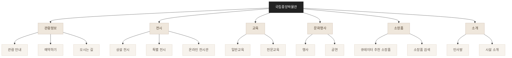
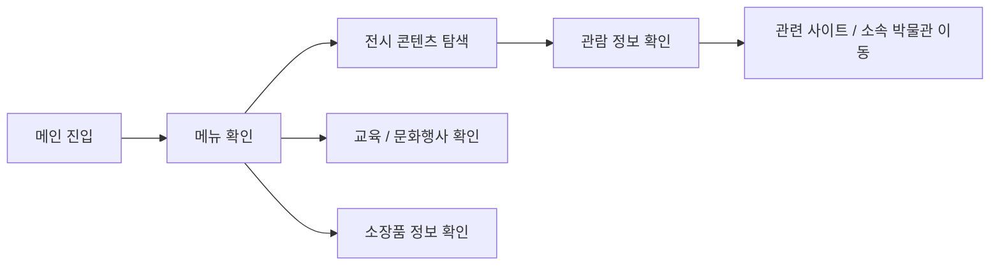
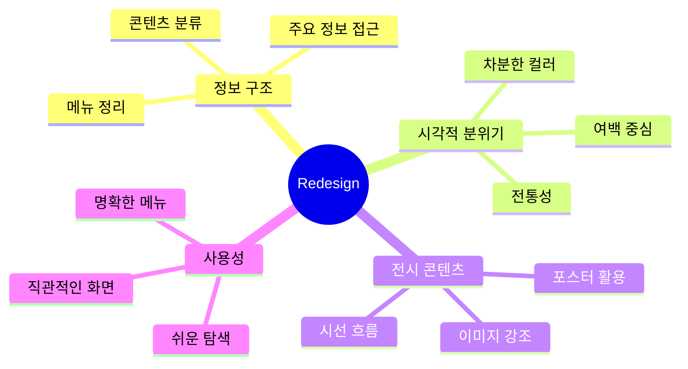
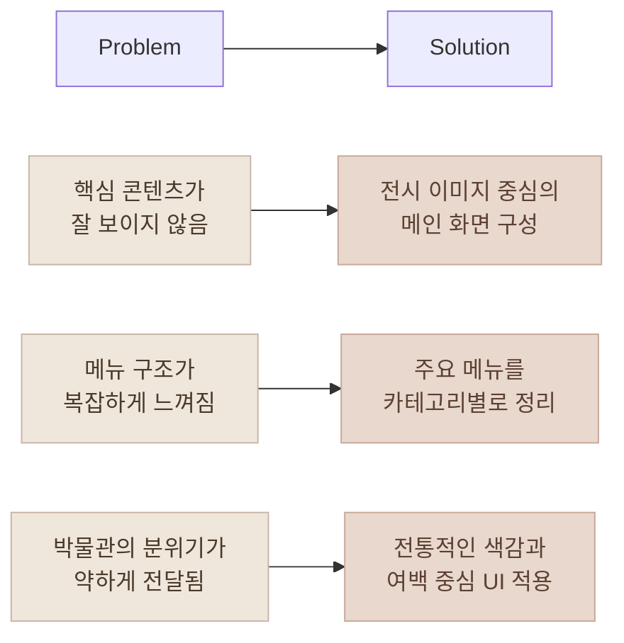
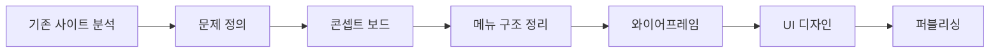

# 국립중앙박물관 웹사이트 리디자인

**전시 콘텐츠가 더 잘 보이고, 필요한 정보를 쉽게 찾을 수 있도록 개선한 웹 리디자인 프로젝트**

`웹 리디자인` `UX/UI 디자인` `반응형 웹` `HTML` `CSS` `JavaScript`

<br/>

## 프로젝트 소개

국립중앙박물관 웹사이트의 정보를 더 직관적으로 탐색할 수 있도록  
메뉴 구조, 메인 화면, 전시 콘텐츠 배치를 개선한 리디자인 프로젝트입니다.

전통적인 분위기와 현대적인 웹 UI가 함께 느껴지도록 구성하고,  
전시 정보와 주요 콘텐츠가 시각적으로 돋보이도록 디자인했습니다.

<br/>

## 바로가기

| 구분        | 링크                                                                              |
| ----------- | --------------------------------------------------------------------------------- |
| 배포 페이지 | [국립중앙박물관 리디자인 바로가기](https://hyunjaeha.github.io/redesign-project/) |
| GitHub      | [Repository](https://github.com/hyunjaeha/redesign-project)                       |

<br/>

## 사용 기술

### Design


### Front-End


<br/>

## 리디자인 목표

| 목표                   | 설명                                                  |
| ---------------------- | ----------------------------------------------------- |
| 정보 구조 개선         | 복잡한 메뉴를 사용자가 이해하기 쉽게 정리             |
| 전시 콘텐츠 강조       | 메인 화면에서 전시 이미지와 콘텐츠가 돋보이도록 구성  |
| 시각적 아이덴티티 강화 | 박물관의 전통성과 차분한 분위기를 시각적으로 표현     |
| 탐색 흐름 개선         | 관람정보, 전시, 교육, 소장품 등 주요 메뉴 접근성 개선 |

<br/>

## 주요 메뉴 구조



<br/>

## 화면 구성

| 화면        | 내용                                    |
| ----------- | --------------------------------------- |
| Main Visual | 박물관의 첫인상을 보여주는 메인 비주얼  |
| Navigation  | 주요 메뉴를 한눈에 볼 수 있는 메뉴 구조 |
| Exhibition  | 전시 콘텐츠와 포스터 중심의 시각적 구성 |
| Video       | 박물관 분위기를 전달하는 영상 영역      |
| Footer      | 주소, 대표전화, 관련 사이트 정보        |

<br/>

## 사용자 흐름



<br/>

## 디자인 방향



<br/>

## 문제 정의와 해결 방향



<br/>

## 디자인 프로세스



<br/>

## 프로젝트 구조

```text
redesign-project
├─ assets/
├─ css/
├─ js/
├─ index.html
└─ README.md
```

<br/>

## 작업 포인트

| 구분       | 내용                                                          |
| ---------- | ------------------------------------------------------------- |
| UX         | 관람정보, 전시, 교육, 소장품 등 주요 메뉴 탐색 흐름 정리      |
| UI         | 전통적인 분위기와 현대적인 레이아웃이 함께 느껴지는 화면 구성 |
| Visual     | 전시 이미지와 포스터를 중심으로 콘텐츠 집중도 강화            |
| Publishing | HTML, CSS, JavaScript 기반 정적 웹사이트 제작                 |

<br/>

## 기대 효과

| Before                               | After                                |
| ------------------------------------ | ------------------------------------ |
| 정보가 많아 복잡하게 느껴짐          | 메뉴를 카테고리별로 정리             |
| 전시 콘텐츠의 집중도가 약함          | 이미지와 포스터 중심으로 시각적 강조 |
| 메인 화면의 정보 우선순위가 불명확함 | 주요 콘텐츠 중심의 화면 흐름 구성    |
| 박물관 분위기가 약하게 전달됨        | 전통성과 차분한 색감을 반영한 디자인 |

<br/>

## 프로젝트 의미

이 프로젝트는 국립중앙박물관 웹사이트의 많은 정보를  
사용자가 더 쉽게 이해하고 탐색할 수 있도록 재구성한 리디자인 작업입니다.

전시 콘텐츠의 매력을 시각적으로 보여주면서도,  
관람 정보와 주요 메뉴에 빠르게 접근할 수 있는 화면을 목표로 제작했습니다.
